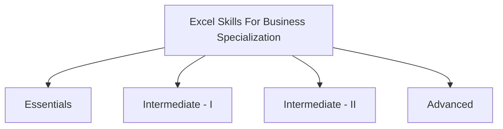

# Excel-Skills-For-Business---Macquarie-University
Here's a revised version of the README for your repository, ensuring originality and clarity:

---

---

# [Excel Skills For Business Specialization - Macquarie University](https://www.coursera.org/specializations/excel)
*This repository contains solutions for the assignments from the "Excel Skills For Business" specialization offered by Macquarie University on Coursera. The courses are taught by [Nicky Bull](https://www.coursera.org/instructor/nicky-bull), [Dr. Prashan S. M. Karunaratne](https://www.coursera.org/specializations/excel#instructors), and [Professor Yvonne Breyer](https://www.coursera.org/instructor/yvonne-breyer).*

## Overview

---

### Skills You'll Develop

- Navigate the Excel interface efficiently and format data professionally.
- Use formulas and functions to automate calculations and data lookups.
- Analyze data and present it clearly using charts and tables.
- Create user-friendly spreadsheets, validate data, and troubleshoot errors.

---

## Specialization Details

This specialization equips learners with essential Excel skills for today's digital world. With millions of job postings requiring Excel proficiency, mastering this tool enhances employability and career prospects. This program offers a comprehensive journey from basics to advanced Excel functionalities, preparing learners for various business scenarios.

### Key Learnings

- Build advanced Excel capabilities, including professional dashboards and complex data analysis.
- Master large dataset management, data extraction, and error prevention.
- Develop skills in data automation, advanced formulas, and predictive modeling.

---

## Practical Learning

The specialization includes practical exercises, downloadable workbooks, and real-world scenarios. These resources enable learners to practice and refine their skills, ensuring a hands-on learning experience.

---

## Specialization Courses

### Course Breakdown

#### 1. Excel Skills for Business: Essentials

Gain foundational Excel skills, from navigation to basic calculations, and learn to create effective visualizations. This course sets the stage for advanced learning by covering core concepts in a structured, beginner-friendly manner.

* [Course Link](https://github.com/yourusername/Excel-Specialization/tree/main/Course-1-Essentials)

#### 2. Excel Skills for Business: Intermediate - I

Explore intermediate Excel techniques, including data management and automation. This course builds on the basics, introducing more sophisticated tools and practices.

* [Course Link](https://github.com/yourusername/Excel-Specialization/tree/main/Course-2-Intermediate-I)

#### 3. Excel Skills for Business: Intermediate - II

Delve deeper into Excel's powerful features, such as error checking, advanced formulas, and data modeling. This course is designed for those looking to refine their analytical skills.

* [Course Link](https://github.com/yourusername/Excel-Specialization/tree/main/Course-3-Intermediate-II)

#### 4. Excel Skills for Business: Advanced

Become an Excel expert by mastering advanced functions, data analysis, and dashboard creation. This course prepares you for professional-level Excel usage, enhancing your data presentation and decision-making skills.

* [Course Link](https://github.com/yourusername/Excel-Specialization/tree/main/Course-4-Advanced)

---

## Certificates

1. [Essentials](https://www.coursera.org/account/accomplishments/verify/897HC2Z74LFW)
2. [Intermediate - I](https://www.coursera.org/account/accomplishments/verify/ZBP5B65WTJCR)
3. [Intermediate - II](https://www.coursera.org/account/accomplishments/verify/W5ZNBZT52DME)
4. [Advanced](https://www.coursera.org/account/accomplishments/verify/M2URRAJ8TCGR)
5. [Specialization Certificate](https://www.coursera.org/account/accomplishments/specialization/SY4QD6RK62TQ)

---

## 📝 Disclaimer
This repository is intended for educational purposes only. Please use the solutions as a reference to aid your understanding and avoid direct copying. The goal is to enhance your learning experience.

## 📝 License
This project is licensed under the [MIT License](https://opensource.org/licenses/MIT). 

---

Feel free to customize this further to reflect your personal touch and any additional information you want to include.
